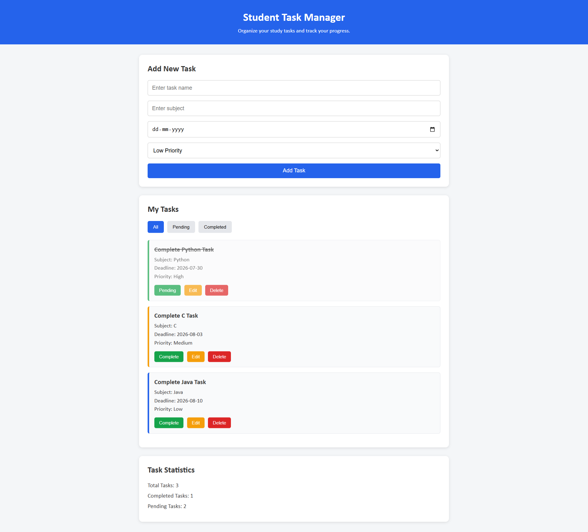

# Student Task Manager

A simple and responsive Student Task Manager web application built using HTML, CSS, and JavaScript.

The application helps students organize study tasks, track deadlines, manage priorities, and monitor task completion progress.

## Live Demo

View the deployed application here:

https://pronay7777.github.io/student-task-manager/

## Project Screenshot

![Student Task Manager Screenshot]

## Features

- Add new study tasks
- Edit existing tasks
- Cancel task editing
- Delete tasks
- Mark tasks as completed
- Move completed tasks back to pending
- Filter tasks by All, Pending, and Completed
- Display total, completed, and pending task statistics
- Low, Medium, and High priority indicators
- Deadline validation to prevent past dates
- Empty-state messages
- Browser localStorage support
- Data persists after browser refresh
- Responsive user interface

## Technologies Used

- HTML5
- CSS3
- JavaScript
- Browser localStorage

## Project Structure

student-task-manager/
│
├── index.html
├── style.css
├── script.js
└── README.md

## How to Run the Project

1. Download or clone the repository.
2. Open the project folder in Visual Studio Code.
3. Open `index.html` using Live Server.

Alternatively, open `index.html` directly in a web browser.

## What I Learned

While building this project, I learned:

- Creating structured webpages using HTML
- Styling responsive interfaces with CSS
- DOM manipulation using JavaScript
- Working with JavaScript arrays and objects
- Creating, updating, and deleting data
- Handling browser events
- Filtering data dynamically
- Managing application state
- Using localStorage for browser persistence
- Form validation and edge-case handling
- Building a complete project step by step

## Future Improvements

- Search tasks by name or subject
- Sort tasks by deadline and priority
- Add due-date warnings
- Dark mode
- User authentication
- Backend API integration
- Database storage
- React frontend version

## Author

Pronay Mondal

## Repository

Source code is available on GitHub:

https://github.com/pronay7777/student-task-manager